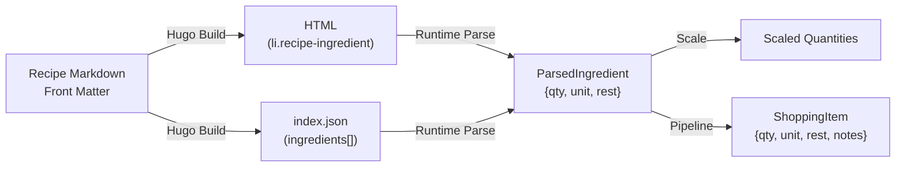

# Ingredient Data Model Redesign

> **Status:** Proposal  
> **Scope:** Ingredient parsing, scaling, shopping list conversion, grocery store sorting  
> **Key Files:**
> [scaler.ts](file:///home/nicholasnooney/projects/noonarby-casa/recipes/themes/cookpot/assets/js/scaler.ts),
> [shopping-list/pipeline.ts](file:///home/nicholasnooney/projects/noonarby-casa/recipes/themes/cookpot/assets/js/shopping-list/pipeline.ts),
> [shopping-list/types.ts](file:///home/nicholasnooney/projects/noonarby-casa/recipes/themes/cookpot/assets/js/shopping-list/types.ts),
> [shopping-list/converters.ts](file:///home/nicholasnooney/projects/noonarby-casa/recipes/themes/cookpot/assets/js/shopping-list/converters.ts),
> [shopping-list/rules.ts](file:///home/nicholasnooney/projects/noonarby-casa/recipes/themes/cookpot/assets/js/shopping-list/rules.ts),
> [shopping-list/config.ts](file:///home/nicholasnooney/projects/noonarby-casa/recipes/themes/cookpot/assets/js/shopping-list/config.ts),
> [meal-plan.ts](file:///home/nicholasnooney/projects/noonarby-casa/recipes/themes/cookpot/assets/js/meal-plan.ts),
> [single.html](file:///home/nicholasnooney/projects/noonarby-casa/recipes/themes/cookpot/layouts/single.html),
> [index.json](file:///home/nicholasnooney/projects/noonarby-casa/recipes/themes/cookpot/layouts/index.json)

---

## Table of Contents

1. [Current Architecture Summary](#1-current-architecture-summary)
2. [Proposal 1: Unified Scaling Model](#2-proposal-1-unified-scaling-model)
3. [Proposal 2: Unified Ingredient Data Model](#3-proposal-2-unified-ingredient-data-model)
4. [Proposal 3: Build-Time Structured Ingredients](#4-proposal-3-build-time-structured-ingredients)
5. [Proposal 4: Shopping List Pipeline Improvements](#5-proposal-4-shopping-list-pipeline-improvements)
6. [Proposal 5: Optional Ingredient Handling](#6-proposal-5-optional-ingredient-handling)
7. [Proposal 6: Grocery Store Section Sorting](#7-proposal-6-grocery-store-section-sorting)
8. [Edge Cases & Robustness Improvements](#8-edge-cases--robustness-improvements)
9. [Implementation Order](#9-implementation-order)

---

## 1. Current Architecture Summary

### Data Flow



### Current Types

| Type                | Location                                                                                                                             | Purpose                                                      |
| ------------------- | ------------------------------------------------------------------------------------------------------------------------------------ | ------------------------------------------------------------ |
| `ParsedIngredient`  | [scaler.ts:4-8](file:///home/nicholasnooney/projects/noonarby-casa/recipes/themes/cookpot/assets/js/scaler.ts#L4-L8)                 | First-pass parse: `{quantity, unit, rest}`                   |
| `IngredientSegment` | [scaler.ts:36-41](file:///home/nicholasnooney/projects/noonarby-casa/recipes/themes/cookpot/assets/js/scaler.ts#L36-L41)             | Handles multi-quantity text: `{type, value, quantity, unit}` |
| `Ingredient`        | [types.ts:32](file:///home/nicholasnooney/projects/noonarby-casa/recipes/themes/cookpot/assets/js/shopping-list/types.ts#L32)        | Union of `ScalableIngredient                                 | FixedIngredient` |
| `ShoppingItem`      | [types.ts:45-53](file:///home/nicholasnooney/projects/noonarby-casa/recipes/themes/cookpot/assets/js/shopping-list/types.ts#L45-L53) | Final output: `{qty, unit, rest, notes, isStaple, parts}`    |

### Current Scaling Approaches

| Context                | Mechanism                                                                  | User-Facing Concept                                                   |
| ---------------------- | -------------------------------------------------------------------------- | --------------------------------------------------------------------- |
| **Single recipe page** | Raw multiplier slider (0.25x – 4x)                                         | "Adjust Servings / Scale" with preset buttons like `0.5x`, `1x`, `2x` |
| **Meal planner cards** | Portions stepper (+/- buttons) backed by `scale = portions / rec.servings` | Shows portion count (e.g., "4"), backed by `rec.servings`             |

---

## 2. Proposal 1: Unified Scaling Model

### Recommendation: Adopt the Portions Model Everywhere

The meal planner's **portions-based scaling** is the superior approach because:

1. **User mental model**: "I need 6 servings" is far more intuitive than "I need 1.5x."
2. **Consistent language**: Both the recipe page and meal planner would say "servings."
3. **The raw multiplier is already derivable**: `scale = desiredServings / recipe.servings`, so nothing is lost.
4. **Enables smarter defaults**: Clicking "4 servings → 6 servings" is clearer than clicking "1.5x."

### Implementation Changes

#### A. Recipe Page Scaling Panel

Replace the current slider+presets in [single.html:77-106](file:///home/nicholasnooney/projects/noonarby-casa/recipes/themes/cookpot/layouts/single.html#L77-L106):

**Current:**

```html
<span class="scale-label">Adjust Servings / Scale</span>
<span class="scale-display"><strong id="scale-display-val">1.0</strong>x</span>
<!-- slider from 0.25 to 4 -->
<!-- preset buttons: 0.25x, 0.5x, 1x, 2x, 4x -->
```

**Proposed:**

```html
<span class="scale-label">Servings</span>
<div class="portion-picker">
  <button type="button" class="portion-btn dec-btn" id="recipe-dec-btn">
    −
  </button>
  <span class="portion-val" id="recipe-serving-count"
    >{{ .Params.servings }}</span
  >
  <button type="button" class="portion-btn inc-btn" id="recipe-inc-btn">
    +
  </button>
</div>
<span class="scale-subtitle">(Original: {{ .Params.servings }})</span>
```

**Key design decisions:**

- The `servings` value from front matter becomes the baseline, rendered into the HTML via Hugo at build time.
- The stepper increments/decrements by 1 serving.
- Internally, `scale = currentServings / baseServings` is computed and used identically to the current `factor` in [scaler.ts:223](file:///home/nicholasnooney/projects/noonarby-casa/recipes/themes/cookpot/assets/js/scaler.ts#L223).
- The `recipe:scale` custom event continues to fire with `{ detail: { factor } }` for backward compatibility.
- Remove the slider and `0.25x`–`4x` preset buttons entirely.
- The existing `.portion-picker` CSS class from the meal planner can be reused for visual consistency.

#### B. Scaler TypeScript Changes

In [scaler.ts](file:///home/nicholasnooney/projects/noonarby-casa/recipes/themes/cookpot/assets/js/scaler.ts), modify `initScaler()`:

1. Read `baseServings` from a `data-base-servings` attribute on a parent element (set by the Hugo template).
2. Replace slider/preset event listeners with stepper button listeners.
3. Compute `factor = currentServings / baseServings` and call the existing `updateRecipeScale(factor)`.

#### C. Meal Planner (No Change Needed)

The meal planner already uses the portions model. No changes required to [adjustPortions](file:///home/nicholasnooney/projects/noonarby-casa/recipes/themes/cookpot/assets/js/meal-plan.ts#L2130-L2143) or [adjustGlobalPortions](file:///home/nicholasnooney/projects/noonarby-casa/recipes/themes/cookpot/assets/js/meal-plan.ts#L660-L670).

---

## 3. Proposal 2: Unified Ingredient Data Model

### Problem

Currently there are three overlapping types that represent an ingredient at different stages:

1. `ParsedIngredient` — first-pass parse, only captures the _leading_ quantity.
2. `IngredientSegment[]` — handles the edge case of multiple quantities in one string.
3. `Ingredient` (union of `ScalableIngredient | FixedIngredient`) — the shopping list pipeline's input.

These need to be **merged into a single canonical type** that flows through the entire pipeline.

### Proposed: `Ingredient` Type

```typescript
/** A single parsed ingredient with all metadata needed for scaling,
 *  shopping list conversion, and future grocery sorting. */
export interface Ingredient {
  /** The primary (leading) numeric quantity, or null if unquantified. */
  quantity: number | null;

  /** The primary unit (e.g. "cup", "pound", "clove", ""). */
  unit: string;

  /** The canonical base item name after cleaning prep terms.
   *  Examples: "chicken breast", "lemon", "garlic", "olive oil" */
  item: string;

  /** The full remaining text after quantity+unit extraction, preserved
   *  for display. May include descriptors that aren't part of the base item.
   *  Example: "extra-virgin olive oil" where item is "olive oil". */
  rest: string;

  /** Extracted preparation terms (e.g. "minced", "diced", "room temperature"). */
  prep: string;

  /** Whether this ingredient is marked optional in the source text. */
  optional: boolean;

  /** Additional quantity segments for inline quantities (e.g. "1 cup broccoli,
   *  about 6 ounces"). Replaces the IngredientSegment array concept. */
  secondarySegments: QuantitySegment[];

  /** Recipe category this ingredient belongs to (e.g. "Cake Batter", "Frosting").
   *  Null for flat ingredient lists. */
  category: string | null;
}

export interface QuantitySegment {
  quantity: number;
  unit: string;
  text: string; // original matched text for display
}
```

### Why Add an `item` Field?

The current `rest` field conflates the base item name with leftover descriptors and prep instructions. Adding a dedicated `item` field solves several problems:

| Problem                                                                                                                                                                                        | How `item` Helps                                                                |
| ---------------------------------------------------------------------------------------------------------------------------------------------------------------------------------------------- | ------------------------------------------------------------------------------- |
| Shopping list merging matches on `rest`, which includes extraneous descriptors like "extra-virgin"                                                                                             | `item` provides a stable, cleaned key: `"olive oil"`                            |
| Grocery store sorting needs to identify the _thing_ being bought                                                                                                                               | Match `item` against a store section map                                        |
| Rules in [config.ts](file:///home/nicholasnooney/projects/noonarby-casa/recipes/themes/cookpot/assets/js/shopping-list/config.ts) use `.terms` to fuzzy-match against `rest`, which is brittle | Rules can match against `item` for exact matching and `rest` for fuzzy fallback |

### Extracting the `item` Field

The `item` field can be derived from `rest` through a **build-time annotation** or a **runtime heuristic**:

1. **Build-time approach (recommended):** Authors annotate the base item in front matter or via a shortcode parameter. See [Proposal 3](#4-proposal-3-build-time-structured-ingredients).
2. **Runtime heuristic (fallback):** Strip leading adjectives/descriptors from `rest` using an allow-list of common modifiers (`extra-virgin`, `unsalted`, `fresh`, `frozen`, `dried`, `whole`, etc.). This is fragile but serves as a fallback when build-time data isn't available.

### Migration from `IngredientSegment`

The `IngredientSegment[]` concept is absorbed into the `secondarySegments` field. The parsing logic in [parseIngredientSegments](file:///home/nicholasnooney/projects/noonarby-casa/recipes/themes/cookpot/assets/js/scaler.ts#L43-L131) remains, but its output is mapped into the unified `Ingredient`:

- The **first** quantity segment populates `quantity` and `unit`.
- **Subsequent** quantity segments populate `secondarySegments`.
- **Text** segments are concatenated into `rest`.

### Migration Steps

1. Define the new `Ingredient` type in [types.ts](file:///home/nicholasnooney/projects/noonarby-casa/recipes/themes/cookpot/assets/js/shopping-list/types.ts).
2. Create a single `parseIngredient(text: string): Ingredient` function that replaces both `parseIngredientText()` and the `ScalableIngredient`/`FixedIngredient` construction in [pipeline.ts:44-96](file:///home/nicholasnooney/projects/noonarby-casa/recipes/themes/cookpot/assets/js/shopping-list/pipeline.ts#L44-L96).
3. Update `convertIngredient()` in [converters.ts](file:///home/nicholasnooney/projects/noonarby-casa/recipes/themes/cookpot/assets/js/shopping-list/converters.ts) to accept the new `Ingredient` type.
4. Deprecate `ParsedIngredient` and `IngredientSegment` exports from `scaler.ts`.

---

## 4. Proposal 3: Build-Time Structured Ingredients

### Problem

Currently, all ingredient parsing happens at runtime via regex in the browser. This means:

1. Parsing errors are invisible until a user views the page.
2. The same string is re-parsed on every page load.
3. The `index.json` emits raw ingredient strings that must be re-parsed by the meal planner.
4. There's no way to annotate structured data (base item, optional flag, category) without encoding it in the text string.

### Proposed: Structured Ingredient Front Matter

Extend the ingredient schema in recipe front matter from plain strings to structured objects, while preserving backward compatibility with plain strings.

**Current format (remains valid):**

```toml
ingredients = [
  "1 cup unsalted butter, at room temperature",
  "2 cloves garlic, minced",
  "Salt",
]
```

**New structured format (opt-in per ingredient):**

```toml
[[ingredients]]
text = "1 cup unsalted butter, at room temperature"
item = "butter"

[[ingredients]]
text = "2 cloves garlic, minced"
item = "garlic"

[[ingredients]]
text = "Crushed red pepper flakes"
optional = true
item = "red pepper flakes"

[[ingredients]]
text = "Salt"
optional = true
```

For categorized recipes, extend the existing map format:

```toml
[[ingredients]]
category = "Cake Batter"
items = [
  { text = "1 cup unsalted butter", item = "butter" },
  { text = "1 tablespoon lemon zest", item = "lemon" },
]

[[ingredients]]
category = "Frosting"
items = [
  { text = "8 ounces cream cheese", item = "cream cheese" },
]
```

### Build-Time Processing

#### A. Hugo Template Changes

In [single.html:155-181](file:///home/nicholasnooney/projects/noonarby-casa/recipes/themes/cookpot/layouts/single.html#L155-L181), emit structured `data-*` attributes:

```html
{{ range $ing := $flatIngredients }} {{ $text := "" }} {{ $item := "" }} {{
$optional := false }} {{ if reflect.IsMap $ing }} {{ $text = $ing.text }} {{
$item = $ing.item | default "" }} {{ $optional = $ing.optional | default false
}} {{ else }} {{ $text = $ing }} {{ end }}
<li
  class="recipe-ingredient"
  {{
  with
  $item
  }}data-item="{{ . }}"
  {{
  end
  }}
  {{
  if
  $optional
  }}data-optional="true"
  {{
  end
  }}
>
  {{ $text }}
</li>
{{ end }}
```

#### B. `index.json` Changes

In [index.json](file:///home/nicholasnooney/projects/noonarby-casa/recipes/themes/cookpot/layouts/index.json), emit structured ingredient objects instead of raw strings:

```json
"ingredients": [
  { "text": "1 cup unsalted butter", "item": "butter", "optional": false },
  { "text": "Salt", "item": "salt", "optional": true }
]
```

This change requires updating the `Recipe.ingredients` type in [meal-plan.ts:17](file:///home/nicholasnooney/projects/noonarby-casa/recipes/themes/cookpot/assets/js/meal-plan.ts#L17) from `string[]` to `IngredientData[]`.

#### C. Backward Compatibility

For ingredients that remain plain strings (no structured annotation), the runtime parsing in `parseIngredient()` serves as the fallback. This allows incremental migration: existing recipes work without changes, and new recipes can opt into the structured format for better accuracy.

#### D. Build-Time Validation

Add Hugo template validation to catch common ingredient issues at build time:

```go-html-template
{{- range $flatIngredients -}}
  {{- $text := cond (reflect.IsMap .) .text . -}}
  {{- if and (strings.Contains (lower $text) "(optional)") (not (and (reflect.IsMap .) .optional)) -}}
    {{- warnf "Ingredient %q in %s contains '(optional)' in text but no 'optional = true' flag. Consider using the structured format." $text $.File.Path -}}
  {{- end -}}
{{- end -}}
```

---

## 5. Proposal 4: Shopping List Pipeline Improvements

### Current Pipeline


### Identified Edge Cases & Fixes

#### Edge Case 1: Parenthetical Size Descriptors Are Lost

**Example:** `"1 package (12- to 18-ounces) shelf-stable potato gnocchi"`

The current parser extracts `qty=1, unit="package", rest="(12- to 18-ounces) shelf-stable potato gnocchi"`. The parenthetical size info ends up in `rest` and gets cleaned unpredictably.

**Fix:** Add a post-parse step that detects parenthetical size ranges like `(X- to Y-unit)` or `(X-unit)` and stores them as a `sizeNote` field on the `Ingredient`. The shopping list renderer can then display it as a note: `"1 package potato gnocchi (12-18 oz)"`.

**Implementation:** Add a regex to the parsing step:

```typescript
const SIZE_PAREN_REGEX =
  /\((\d+[-–]?\s*(?:to\s+)?\d*[-–]?\s*(?:ounces?|oz|pounds?|lb))\)/i;
```

#### Edge Case 2: "to taste" / "for garnish" Ingredients

**Example:** `"Salt, to taste"`, `"1 lemon, thinly sliced (for garnish)"`

Currently `cleanPrepTerms` strips `"for serving"` but not `"to taste"`, `"for garnish"`, `"for topping"`, or `"as needed"`.

**Fix:** Extend the suffix stripping in [utils.ts:98](file:///home/nicholasnooney/projects/noonarby-casa/recipes/themes/cookpot/assets/js/shopping-list/utils.ts#L98) to handle these patterns:

```typescript
text = text
  .replace(
    /,?\s+(?:plus\s+more\s+)?(?:for\s+(?:serving|garnish|topping|dipping|drizzling)|to\s+taste|as\s+needed)\b/gi,
    "",
  )
  .trim();
```

#### Edge Case 3: Descriptor Collisions in Merging

**Example:** A recipe has both `"1 cup extra-virgin olive oil"` and `"2 tablespoons olive oil"`. After unit conversion, these should merge but currently they don't because `rest` differs (`"extra-virgin olive oil"` vs `"olive oil"`).

**Fix:** Use the `item` field (from Proposal 2) as the merge key instead of `rest`. Fallback to `rest` when `item` is not available. Update [getIngredientKey](file:///home/nicholasnooney/projects/noonarby-casa/recipes/themes/cookpot/assets/js/shopping-list/rules.ts#L212-L223) and [getShoppingItemKey](file:///home/nicholasnooney/projects/noonarby-casa/recipes/themes/cookpot/assets/js/shopping-list/rules.ts#L225-L234) to prefer `item` over `rest`.

#### Edge Case 4: Mixed-Unit Same-Item Doesn't Convert

**Example:** `"1 pound chicken breast"` and `"8 ounces chicken breast"` are both in the same recipe. They don't merge because there's no rule for `chicken breast` and the raw units differ.

**Fix:** Add a generic weight-unit normalization step to the pipeline. Before merging, if two items have the same `item`/`rest` and both use weight units (`pound`, `ounce`, `gram`), convert to the largest appropriate unit and sum:

```typescript
// New weight conversion constants (analogous to TO_TEASPOONS for volume)
const TO_OUNCES: Record<string, number> = {
  ounce: 1,
  oz: 1,
  pound: 16,
  lb: 16,
  gram: 0.03527,
  g: 0.03527,
};
```

#### Edge Case 5: Category Context Lost in Shopping List

**Example:** The Lemon Raspberry Cake has "butter" in both "Cake Batter" and "Frosting" categories. Currently the category information is lost when ingredients are flattened, and the two butter entries correctly merge by quantity. But when a user sees "14 tablespoons butter" on the shopping list, they lose the context of where it's needed.

**Fix:** Preserve `category` as a note source. When items merge from different categories, append category labels to the notes: `"need 8 tbsp (Cake Batter) + 10 tbsp (Frosting)"`. This is already partially supported by the `notes` record structure in `ShoppingItem`.

#### Edge Case 6: The `"divided"` Prep Keyword

**Example:** `"1/2 cup fresh lemon juice, divided"` — the word "divided" indicates the ingredient is used in multiple steps. The parser strips it as a prep term, which is correct, but the shopping list should still show the full quantity (not divided).

**Current behavior:** Works correctly because `"divided"` is stripped and the full quantity is used. No change needed, but worth documenting.

#### Edge Case 7: "plus more for X" Patterns

**Example:** `"1/4 cup grated Parmesan, plus more for serving"`

Currently, `"plus more for serving"` is stripped from the text. The shopping list shows `"1/4 cup Parmesan"`. The user might want a hint that they need extra.

**Fix:** Detect `"plus more"` patterns and add a note to the shopping item: `"+ extra for serving"`. This could be added as a `note` entry during the `cleanPrepTerms` step.

#### Edge Case 8: Numeric Ranges in Quantity

**Example:** `"12- to 18-ounces"` in gnocchi, `"1½- to 2-inch pieces"` in broccoli.

The current parser can't handle hyphenated ranges as quantities. These should be detected and the _upper bound_ used for shopping purposes (conservative estimate).

**Fix:** Add a range regex pattern to `parseNumeric`:

```typescript
const RANGE_REGEX = /^(\d+(?:\.\d+)?)\s*[-–]\s*(?:to\s+)?(\d+(?:\.\d+)?)/;
// Use the upper bound for shopping, lower bound for display
```

### Pipeline Architecture Improvement

The current pipeline couples DOM access with business logic. The [processShoppingList](file:///home/nicholasnooney/projects/noonarby-casa/recipes/themes/cookpot/assets/js/shopping-list/pipeline.ts#L26-L39) function takes `HTMLElement[]` as input, which forces the meal planner to create mock DOM elements in [meal-plan.ts:2247-2268](file:///home/nicholasnooney/projects/noonarby-casa/recipes/themes/cookpot/assets/js/meal-plan.ts#L2247-L2268).

**Fix:** Refactor the pipeline to accept `Ingredient[]` directly:

```typescript
// New signature
export function processShoppingList(
  ingredients: Ingredient[],
): ProcessedShoppingList;

// Separate DOM extraction
export function extractIngredientsFromDOM(
  scale: number,
  elements: NodeListOf<HTMLElement> | HTMLElement[],
): Ingredient[];
```

This allows the meal planner to construct `Ingredient[]` directly from `index.json` data without creating fake DOM elements.

---

## 6. Proposal 5: Optional Ingredient Handling

### Current State

Optional ingredients are marked with `"(optional)"` in the text string. The system does **nothing special** with this — they appear in both the recipe view and shopping list identically to required ingredients.

### Proposed Improvements

#### A. Visual Differentiation in Recipe View

When `data-optional="true"` is present on a `.recipe-ingredient` element (set at build time per Proposal 3):

- Render a subtle "optional" badge or italic styling.
- Slightly reduce visual weight (e.g., lighter text color, or a dashed left border).

#### B. Shopping List: Separate Optional Section

In the shopping list view, introduce a third section:

```
📋 Need to Buy
  - 1 package potato gnocchi
  - 1 lb Italian sausage
  ...

🔸 Optional
  - Red pepper flakes
  - 1/2 cup chocolate chips
  ...

🏠 Pantry Staples
  - Salt
  - Olive oil
  ...
```

**Implementation:** In [processShoppingList](file:///home/nicholasnooney/projects/noonarby-casa/recipes/themes/cookpot/assets/js/shopping-list/pipeline.ts#L26-L39), add a third output category:

```typescript
export interface ProcessedShoppingList {
  buyItems: ShoppingItem[];
  optionalItems: ShoppingItem[];
  stapleItems: ShoppingItem[];
}
```

The `optional` flag flows from the `Ingredient` through to `ShoppingItem`:

```typescript
export interface ShoppingItem {
  // ... existing fields
  optional: boolean;
}
```

#### C. Meal Planner Shopping List

In the combined shopping list, optional items from _all_ planned recipes should be grouped together with recipe attribution:

```
🔸 Optional
  - Red pepper flakes (Crispy Gnocchi)
  - 1 tsp cinnamon (PB Banana Muffins)
```

#### D. Copy-to-Clipboard

When copying the shopping list, optional items should be in a separate section labeled `OPTIONAL:`.

---

## 7. Proposal 6: Grocery Store Section Sorting

### Design Overview

Implement a grocery store aisle/section ordering system that sorts shopping list items by their physical location in a store.

### Data Structure: Store Section Map

Define a static section ordering configuration:

```typescript
// New file: shopping-list/store-sections.ts

export interface StoreSection {
  /** Unique identifier */
  id: string;
  /** Display name */
  name: string;
  /** Sort order (lower = earlier in the store) */
  order: number;
  /** Item keywords that belong to this section */
  keywords: string[];
}

export const STORE_SECTIONS: StoreSection[] = [
  {
    id: "produce",
    name: "🥬 Produce",
    order: 1,
    keywords: [
      "lettuce",
      "tomato",
      "onion",
      "garlic",
      "ginger",
      "lemon",
      "lime",
      "broccoli",
      "scallion",
      "green onion",
      "cabbage",
      "zucchini",
      "potato",
      "carrot",
      "celery",
      "mushroom",
      "pepper",
      "herb",
      "basil",
      "cilantro",
      "parsley",
      "rosemary",
      "thyme",
      "avocado",
      "banana",
      "apple",
      "berry",
      "raspberry",
      "blueberry",
      "strawberry",
    ],
  },
  {
    id: "bakery",
    name: "🍞 Bakery",
    order: 2,
    keywords: ["bread", "roll", "bun", "tortilla", "pita", "naan", "brioche"],
  },
  {
    id: "meat",
    name: "🥩 Meat & Seafood",
    order: 3,
    keywords: [
      "chicken",
      "beef",
      "pork",
      "sausage",
      "bacon",
      "turkey",
      "ground",
      "steak",
      "salmon",
      "shrimp",
      "fish",
    ],
  },
  {
    id: "dairy",
    name: "🧀 Dairy & Eggs",
    order: 4,
    keywords: [
      "milk",
      "cream",
      "butter",
      "cheese",
      "yogurt",
      "egg",
      "sour cream",
      "cream cheese",
      "ricotta",
      "mozzarella",
      "parmesan",
      "cheddar",
    ],
  },
  {
    id: "deli",
    name: "🥪 Deli",
    order: 5,
    keywords: ["deli", "hummus", "pesto"],
  },
  {
    id: "frozen",
    name: "❄️ Frozen",
    order: 6,
    keywords: ["frozen", "ice cream"],
  },
  {
    id: "pasta-grains",
    name: "🍝 Pasta & Grains",
    order: 7,
    keywords: [
      "pasta",
      "spaghetti",
      "penne",
      "fettuccine",
      "linguine",
      "noodle",
      "rice",
      "orzo",
      "couscous",
      "quinoa",
      "gnocchi",
      "lasagna",
      "macaroni",
    ],
  },
  {
    id: "canned",
    name: "🥫 Canned & Jarred",
    order: 8,
    keywords: [
      "can",
      "canned",
      "tomato paste",
      "tomato sauce",
      "beans",
      "chickpea",
      "coconut milk",
      "broth",
      "stock",
    ],
  },
  {
    id: "condiments",
    name: "🫙 Condiments & Sauces",
    order: 9,
    keywords: [
      "sauce",
      "soy sauce",
      "vinegar",
      "mustard",
      "ketchup",
      "mayo",
      "hot sauce",
      "sriracha",
      "tahini",
      "honey",
      "maple syrup",
      "jam",
      "jelly",
    ],
  },
  {
    id: "baking",
    name: "🧁 Baking",
    order: 10,
    keywords: [
      "flour",
      "sugar",
      "baking powder",
      "baking soda",
      "vanilla",
      "cornstarch",
      "yeast",
      "chocolate chip",
      "cocoa",
      "confectioners",
    ],
  },
  {
    id: "oils",
    name: "🫒 Oils & Vinegars",
    order: 11,
    keywords: [
      "oil",
      "olive oil",
      "vegetable oil",
      "canola oil",
      "sesame oil",
      "coconut oil",
    ],
  },
  {
    id: "spices",
    name: "🌶️ Spices & Seasonings",
    order: 12,
    keywords: [
      "salt",
      "pepper",
      "paprika",
      "cumin",
      "oregano",
      "cinnamon",
      "nutmeg",
      "turmeric",
      "coriander",
      "cardamom",
      "cloves",
      "allspice",
      "chili powder",
      "cayenne",
      "garlic powder",
      "onion powder",
      "ginger powder",
      "red pepper flakes",
      "italian seasoning",
    ],
  },
  {
    id: "snacks",
    name: "🍿 Snacks",
    order: 13,
    keywords: [
      "chip",
      "cracker",
      "pretzel",
      "nut",
      "almond",
      "peanut",
      "walnut",
      "pecan",
      "cashew",
    ],
  },
  {
    id: "beverages",
    name: "🥤 Beverages",
    order: 14,
    keywords: ["water", "juice", "soda", "wine", "beer"],
  },
  {
    id: "other",
    name: "📦 Other",
    order: 99,
    keywords: [],
  },
];
```

### Matching Algorithm

```typescript
/**
 * Determines which store section a shopping item belongs to.
 * Uses the `item` field (if available) for precise matching,
 * falls back to `rest` for fuzzy matching.
 */
export function getStoreSection(item: ShoppingItem): StoreSection {
  const searchText = (item.item || item.rest).toLowerCase();

  // Exact match first (longer keywords first for specificity)
  for (const section of STORE_SECTIONS) {
    if (section.keywords.some((kw) => searchText.includes(kw))) {
      return section;
    }
  }

  // Fallback to "Other"
  return STORE_SECTIONS[STORE_SECTIONS.length - 1];
}
```

### Integration with Shopping List

#### A. Sort Order

After the pipeline produces `buyItems`, sort them by section order:

```typescript
buyItems.sort((a, b) => {
  const sectionA = getStoreSection(a);
  const sectionB = getStoreSection(b);
  return sectionA.order - sectionB.order;
});
```

#### B. Section Headers in Rendering

Group items by section and render with section headers:

```html
<h4 class="store-section-header">🥬 Produce</h4>
<ul class="shopping-section-items">
  <li>1 head broccoli</li>
  <li>2 lemons</li>
</ul>
<h4 class="store-section-header">🥩 Meat & Seafood</h4>
<ul class="shopping-section-items">
  <li>1 lb Italian sausage</li>
</ul>
```

#### C. User Customization (Future)

Store section order could be made customizable via localStorage, allowing users to reorder sections to match their specific grocery store layout. This is a stretch goal and not required for the initial implementation.

### Interaction with `ShoppingItem`

Add an optional `section` field to `ShoppingItem`:

```typescript
export interface ShoppingItem {
  // ... existing fields
  section?: string; // e.g. "produce", "dairy"
}
```

The section is assigned during `finalizeItem` using the matching algorithm above.

### Interaction with `item` Field

The `item` field from Proposal 2 significantly improves section matching accuracy:

| Without `item`                                                                                 | With `item`                                                             |
| ---------------------------------------------------------------------------------------------- | ----------------------------------------------------------------------- |
| `rest = "extra-virgin olive oil"` → matches "oil" → "Oils" ✅                                  | `item = "olive oil"` → matches "olive oil" → "Oils" ✅                  |
| `rest = "Italian sausage, casings removed"` → matches "sausage" → "Meat" ✅                    | Same                                                                    |
| `rest = "confectioners' sugar, more if needed (for frosting)"` → matches "sugar" → "Baking" ✅ | `item = "confectioners' sugar"` → matches "confectioners" → "Baking" ✅ |
| `rest = "peanut butter"` → matches "peanut" → "Snacks" ❌                                      | `item = "peanut butter"` → would need a rule → "Condiments" ✅          |

The `item` field makes section matching more predictable and reduces false positives from substring matching.

---

## 8. Edge Cases & Robustness Improvements

### Summary of All Identified Edge Cases

| #   | Edge Case                                                           | Current Behavior                           | Proposed Fix                               | Priority |
| --- | ------------------------------------------------------------------- | ------------------------------------------ | ------------------------------------------ | -------- |
| 1   | Parenthetical sizes `(12-18 oz)`                                    | Included in `rest`, unpredictable cleaning | Parse into `sizeNote` field                | Medium   |
| 2   | `"to taste"`, `"for garnish"`, `"as needed"`                        | Only `"for serving"` is stripped           | Extend suffix stripping regex              | High     |
| 3   | Descriptor collisions (`"extra-virgin olive oil"` vs `"olive oil"`) | Don't merge                                | Use `item` field as merge key              | High     |
| 4   | Mixed weight units (lb + oz same item)                              | Don't merge                                | Add weight unit normalization              | Medium   |
| 5   | Category context lost in shopping list                              | No category info in shopping items         | Preserve category as note source           | Low      |
| 6   | `"divided"` keyword                                                 | Correctly stripped                         | No change needed                           | N/A      |
| 7   | `"plus more for X"` patterns                                        | Stripped silently                          | Add `"+ extra"` note                       | Low      |
| 8   | Numeric ranges `"12- to 18-ounces"`                                 | Not parsed as quantities                   | Use upper bound for shopping               | Medium   |
| 9   | Optional ingredients in shopping list                               | No differentiation                         | Separate section                           | Medium   |
| 10  | Mock DOM elements in meal planner                                   | Creates fake `HTMLElement`s                | Refactor pipeline to accept `Ingredient[]` | High     |
| 11  | `index.json` emits raw strings                                      | Re-parsed at runtime                       | Emit structured objects                    | Medium   |
| 12  | No build-time ingredient validation                                 | Errors only visible at runtime             | Hugo template warnings                     | Medium   |

### Additional Considerations

#### Weight-Based vs Volume-Based Overlap

Some ingredients can be measured by both weight and volume (e.g., `"1 cup shredded cheese"` vs `"8 ounces shredded cheese"`). The current system doesn't handle cross-system conversions. A future enhancement could add ingredient-specific density constants, but this is complex and low priority. For now, only same-system merging (volume↔volume, weight↔weight) should be attempted.

#### Plural/Singular Unit Normalization

The current [PLURAL_TO_SINGULAR](file:///home/nicholasnooney/projects/noonarby-casa/recipes/themes/cookpot/assets/js/units.ts) mapping handles common cases, but edge cases exist:

- `"leaves"` → `"leaf"` (missing)
- `"halves"` → `"half"` (missing)

Add missing plural mappings to the units configuration.

#### Compound Ingredients

Ingredients like `"1 package (12- to 18-ounces) shelf-stable potato gnocchi"` are compound: they have a count-based quantity (`1 package`) _and_ a weight qualifier (`12-18 oz`). The parser should handle the primary quantity (`1 package`) and preserve the weight as metadata.

---

## 9. Implementation Order

The proposals are ordered to minimize breaking changes and maximize incremental value.

### Phase 1: Foundation (Low Risk, High Impact)

1. **Refactor pipeline to accept `Ingredient[]`** — Decouple DOM from business logic. This unblocks the meal planner cleanup and is a pure internal refactor.
2. **Extend suffix stripping** — Add `"to taste"`, `"for garnish"`, `"as needed"` patterns. Small, safe change.
3. **Add `optional` detection** — Parse `"(optional)"` from text and strip it, setting a boolean flag.

### Phase 2: Data Model (Medium Risk, High Impact)

4. **Define unified `Ingredient` type** — Create the new type and a single `parseIngredient()` function.
5. **Add `item` field with runtime heuristic** — Implement the descriptor-stripping logic to auto-derive `item` from `rest`.
6. **Update shopping list merging** — Use `item` as the primary merge key.

### Phase 3: Build-Time (Medium Risk, Medium Impact)

7. **Structured ingredient front matter** — Define the new TOML schema, update Hugo templates.
8. **Update `index.json` to emit structured data** — Change the template and the `Recipe` type in `meal-plan.ts`.
9. **Add build-time validation** — Hugo template warnings for common issues.
10. **Migrate existing recipes** — Incrementally add `item` and `optional` annotations to existing recipe front matter.

### Phase 4: Scaling UX (Low Risk, High Impact)

11. **Unified portions-based scaling** — Replace the slider with a stepper on the single recipe page.
12. **Reuse `.portion-picker` CSS** — Visual consistency between recipe page and meal planner.

### Phase 5: Features (Medium Risk, Medium Impact)

13. **Optional ingredient section in shopping list** — Add the third section to both recipe and meal planner views.
14. **Grocery store section sorting** — Implement `STORE_SECTIONS` config and section assignment.
15. **Section-grouped rendering** — Add section headers to shopping list UI.

### Phase 6: Polish (Low Risk, Low Impact)

16. **Category context in shopping notes** — Preserve category labels through the pipeline.
17. **"Plus more" notes** — Detect and add `"+ extra"` notes.
18. **Parenthetical size parsing** — Extract `(12-18 oz)` into metadata.
19. **Weight unit normalization** — Add `TO_OUNCES` conversion table.
20. **Missing plural mappings** — Add `"leaves"`, `"halves"`, etc.
