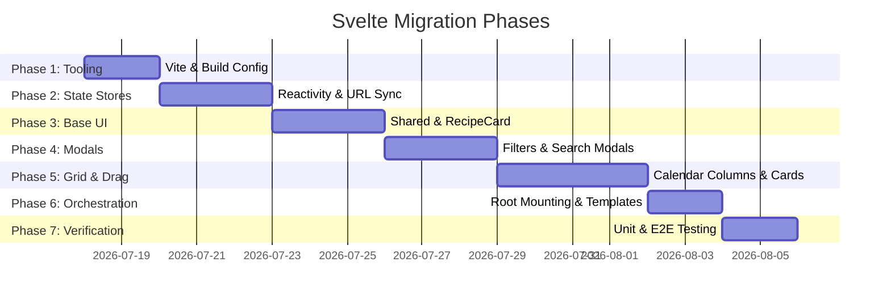

# Noonarby Casa Recipes: Svelte Island Migration Plan

This document outlines the step-by-step execution roadmap to migrate the interactive Meal Planner page from the monolithic [meal-plan.ts](file:///home/nicholasnooney/projects/noonarby-casa/recipes/themes/cookpot/assets/js/meal-plan.ts) and [plan.html](file:///home/nicholasnooney/projects/noonarby-casa/recipes/themes/cookpot/layouts/plan.html) templates into modular, component-driven Svelte islands.

---

## 🗺️ Migration Overview

- **Goal:** Break up the 4,000+ line meal planner monolith, automate dynamic HTML rendering, simplify state/URL sync, and enable code reuse.
- **Core Strategy:** Retain **Hugo** as the static site generator, compiling Svelte islands using **Vite** into standalone client bundles mounted on page-specific target divs (e.g., `#meal-planner`).
- **Aesthetics & CSS:** Perform a progressive CSS migration, moving rules out of `meal-plan.css` and into scoped Svelte `<style>` tags step-by-step.
- **Testing:** Keep pure logic tests intact. Add Svelte Testing Library under Vitest. Playwright E2E tests serve as the primary migration verification tool.

---

## 🛠️ Phase-by-Phase Task Breakdown (Shards)



---

### 🧩 Task 1: Build Setup & Pipeline Integration

**Objective:** Configure Vite to compile Svelte components and export them to Hugo's static asset directory.

1.  **Install Dependencies:**
    Add Vite, Svelte 5, and TypeScript support packages:
    ```bash
    pnpm add -D vite svelte @sveltejs/vite-plugin-svelte vite-plugin-css-injected-by-js svelte-check eslint-plugin-svelte
    ```
2.  **Create Vite Config (`vite.config.ts`):**
    Configure Vite to preprocess Svelte components via `vitePreprocess`, bundle CSS inside the IIFE JS bundle (using `vite-plugin-css-injected-by-js` for clean inline injection), and output directly to the Hugo static directory:
    ```typescript
    import { defineConfig } from 'vite';
    import { svelte, vitePreprocess } from '@sveltejs/vite-plugin-svelte';
    import cssInjectedByJsPlugin from 'vite-plugin-css-injected-by-js';

    export default defineConfig({
      plugins: [
        svelte({
          preprocess: vitePreprocess(),
        }),
        cssInjectedByJsPlugin(),
      ],
      build: {
        outDir: 'themes/cookpot/static/dist',
        emptyOutDir: true,
        lib: {
          entry: 'themes/cookpot/assets/js/svelte-main.ts',
          name: 'MealPlanner',
          formats: ['iife'],
          fileName: () => 'meal-planner.js',
        },
      },
    });
    ```
3.  **Configure `.gitignore`:**
    Add `/themes/cookpot/static/dist` to `.gitignore` to avoid checking compiled assets into version control.
4.  **Create Type Declarations (`themes/cookpot/assets/js/svelte-shims.d.ts`):**
    Enable TypeScript to import `.svelte` files without type errors:
    ```typescript
    declare module '*.svelte' {
      import type { Component } from 'svelte';
      const component: Component<any, any>;
      export default component;
    }
    ```
5.  **Create Entrypoint (`themes/cookpot/assets/js/svelte-main.ts`):**
    A single entrypoint handles dynamically mounting components using Svelte 5's `mount` function based on DOM targets:
    ```typescript
    import { mount } from 'svelte';
    import MealPlannerApp from './components/MealPlannerApp.svelte';
    import HomepageSearchApp from './components/HomepageSearchApp.svelte';
    import SingleRecipeScaler from './components/SingleRecipeScaler.svelte';
    import FavoriteButton from './components/FavoriteButton.svelte';
    import TimersManager from './components/TimersManager.svelte';
    import InlineTimer from './components/InlineTimer.svelte';

    document.addEventListener('DOMContentLoaded', () => {
      // 1. Planner App mount
      const plannerTarget = document.getElementById('meal-planner');
      if (plannerTarget) {
        mount(MealPlannerApp, { target: plannerTarget });
      }

      // 2. Homepage Search mount
      const homepageSearchTarget = document.getElementById(
        'homepage-search-mount',
      );
      if (homepageSearchTarget) {
        mount(HomepageSearchApp, { target: homepageSearchTarget });
      }

      // 3. Single Recipe page mounts
      const scalerTarget = document.getElementById('recipe-scale-mount');
      if (scalerTarget) {
        mount(SingleRecipeScaler, { target: scalerTarget });
      }

      const favoriteTarget = document.getElementById('recipe-favorite-mount');
      if (favoriteTarget) {
        mount(FavoriteButton, { target: favoriteTarget });
      }

      const timersTarget = document.getElementById('recipe-timers-mount');
      if (timersTarget) {
        mount(TimersManager, { target: timersTarget });
      }

      // 4. Mount inline timers on static step instruction links
      const inlineTimerContainers = document.querySelectorAll('.recipe-timer');
      inlineTimerContainers.forEach((container) => {
        mount(InlineTimer, { target: container as HTMLElement });
      });
    });
    ```
6.  **Integrate Script into Hugo Layouts:**
    Load `/dist/meal-planner.js` dynamically inside [head/js.html](file:///home/nicholasnooney/projects/noonarby-casa/recipes/themes/cookpot/layouts/_partials/head/js.html).

---

### 🧩 Task 2: Core State Stores (`stores/`)

**Objective:** Port the monolithic state logic into dedicated Svelte stores syncing with LocalStorage.

Create the files inside `themes/cookpot/assets/js/stores/`:

1.  **`planner.ts`:**
    - State `plannerState` (`PlannedItem[]`).
    - Initialize from `localStorage.getItem('noonarby-meal-plan')`.
    - Implement actions: `addRecipe()`, `removeRecipe()`, `updateScale()`, `reorderRecipes()`, `clearPlan()`, `mergePlan(otherPlan)`, and `generateDinnerPlan()`.
    - Implement temporary preview and comparison state triggers to resolve plan conflicts without prematurely overwriting local storage.
    - Implement deletion history state (`lastRemovedRecipe`, `lastRemovedIndex`) with an `undoRemove()` action.
    - Subscribe to automatically save updates to `localStorage`.
2.  **`shopping.ts`:**
    - State `shoppingListStates` (`Record<string, boolean>`).
    - Sync state with `'noonarby-shopping-checked-items-v2'`.
    - Correctly handle pre-checked status logic for pantry staple items.
    - Derived store `combinedShoppingList` that aggregates `plannerState` and parses/groups ingredients using [pipeline.ts](file:///home/nicholasnooney/projects/noonarby-casa/recipes/themes/cookpot/assets/js/shopping-list/pipeline.ts).
3.  **`settings.ts` & `filters.ts`:**
    - `settingsStore`: Tracks `activeTab` ('edit' | 'view' | 'shop') and `workWeekOnly` (boolean).
    - `filtersStore`: Tracks `searchQuery`, `favoritesOnly`, `includedTags`, etc.
4.  **`favorites.ts`:**
    - Shared favorites set store syncing with `noonarby_favorites`.
    - Listens to and dispatches `'favoritesChanged'` custom events to coordinate with any remaining static pages.
5.  **`urlSync.ts` (Derived URL Store):**
    - A derived store `urlQueryString` that aggregates `plannerState` and `settingsStore`.
    - Write a subscription callback to replace history state dynamically:
      ```typescript
      urlQueryString.subscribe((query) => {
        const path = window.location.pathname;
        window.history.replaceState({}, '', query ? `${path}?${query}` : path);
      });
      ```

---

### 🧩 Task 3: Base Shared Svelte Components

**Objective:** Build low-level UI components and the shared recipe card to isolate styles.

1.  **`Button.svelte` & `ToggleGroup.svelte`:**
    - Port styles from button components.
2.  **`PortionPicker.svelte`:**
    - An isolated increment/decrement servings widget.
3.  **`RecipeCard.svelte` (Base Card):**
    - Port layout and styles from [recipe-list-item.html](file:///home/nicholasnooney/projects/noonarby-casa/recipes/themes/cookpot/layouts/_partials/recipe-list-item.html) and [recipe-list.css](file:///home/nicholasnooney/projects/noonarby-casa/recipes/themes/cookpot/assets/css/recipe-list.css).
    - Supports a `<slot />` element for custom overlays.
    - Accepts props: `recipe`, `linkable` (boolean), `showFavorite` (boolean).

---

### 🧩 Task 4: Browse Shelf, Search, and Modals

**Objective:** Port the filter panel overlays, search modal UI, and item details to Svelte.

1.  **`FiltersModal.svelte`:**
    - Displays tags and sources checkboxes dynamically extracted and sorted from the `recipesIndex`.
    - Imports and updates `filtersStore`.
    - Applies transition logic for opening/closing overlays.
2.  **`RecipeSelectorModal.svelte`:**
    - Includes the text search input and lists filtered results.
    - Uses Svelte's key bindings to handle accessibility.
3.  **`PlannedRecipeDetailsModal.svelte`:**
    - Triggered from planned recipe cards to edit portion scale, toggle favorites, and manage `extraIngredients` / side dishes (using `parseRawUserInput` and `assembleIngredientText`).
4.  **`BrowseCard.svelte`:**
    - Wraps `<RecipeCard>` and inserts a slot wrapper button with an `on:click={() => addRecipeToDay(day)}` callback.

---

### 🧩 Task 5: Calendar Grid & Drag mechanics

**Objective:** Implement the meal planning columns and integrate the drag-and-drop system.

1.  **`PlannedRecipeCard.svelte`:**
    - Wraps `<RecipeCard>` with drag handles, delete triggers, and inline servings selector inputs.
2.  **`DayColumn.svelte`:**
    - Displays a column representing a day of the week.
    - Filters `$plannerState` and renders cards.
    - Integrates HTML5 Drag-and-Drop listeners (`dragover`, `drop`, `dragleave`) to trigger `reorderRecipes` inside the planner store.
3.  **`CalendarGrid.svelte`:**
    - Arranges `DayColumn` subcomponents based on the active `$settingsStore.workWeekOnly` parameter.
    - Displays empty state cards where no recipes have been scheduled.
    - Embeds a `DietBreakdownPanel.svelte` at the bottom to calculate and render diet breakdown statistics.

---

### 🧩 Task 6: Orchestration, HTML layouts & Build Hookup

**Objective:** Clean up the legacy template assets and run the Svelte application.

1.  **`MealPlannerApp.svelte` (Planner Root Component):**
    - Renders the primary container layout.
    - Switches between view sub-columns based on the active mobile nav tab.
    - Embeds `ConflictBanner`, `NavigationTabs`, `ControlsToolbar`, `CalendarGrid`, `ShoppingListColumn`, and the `UndoToast.svelte` component.
2.  **`HomepageSearchApp.svelte` (Homepage Root Component):**
    - Orchestrates the search input field, filter tag bar, and filter chips.
    - Uses `RecipeCard.svelte` to display dynamically filtered recipe search results in the homepage grid.
3.  **Layout Cleanup (`plan.html` and `home.html`):**
    - **`plan.html`:** Remove legacy DOM markup and replace with `<div id="meal-planner"></div>`.
    - **`home.html`:** Replace search container and dynamic search results with a mount point: `<div id="homepage-search-mount"></div>`.
4.  **Disable Legacy Logic:**
    - Comment out `initMealPlanner()` and `initSearch()` inside [main.ts](file:///home/nicholasnooney/projects/noonarby-casa/recipes/themes/cookpot/assets/js/main.ts) once the Svelte components are verified.

---

### 🧩 Task 7: Single Recipe Page Islands

**Objective:** Migrate the interactive elements on individual recipe detail pages to Svelte components.

1.  **`SingleRecipeScaler.svelte` (Servings adjustment):**
    - Mounts on `#recipe-scale-mount` in [single.html](file:///home/nicholasnooney/projects/noonarby-casa/recipes/themes/cookpot/layouts/single.html).
    - Wraps the servings portions selector buttons and reactively queries/mutates static DOM ingredient list elements (`.recipe-ingredient` and `.recipe-quantity`) to scale text quantities.
2.  **`FavoriteButton.svelte` (Favorites Toggle):**
    - Mounts on `#recipe-favorite-mount`.
    - Imports and modifies the global `favoritesStore` to update localStorage and trigger `'favoritesChanged'` custom events to sync with static elements.
3.  **`InlineTimer.svelte`:**
    - Mounted on each `.recipe-timer` container.
    - Reacts to timer store state to update progress text and apply classes (`.has-started`, `.in-range`, `.expired`).
4.  **`TimersManager.svelte` (Cooking Timers Overlay):**
    - Listens for clicks on timer markdown links in recipe instruction steps.
    - Appends countdown objects to a shared active timers list and renders floating active timer countdown overlay panels on the screen.
    - Integrates audio alerts (using `playLowerBoundChime`, `playUpperBoundChime`, and `stopAudio` from [audio.ts](file:///home/nicholasnooney/projects/noonarby-casa/recipes/themes/cookpot/assets/js/audio.ts)) and Screen Wake Lock API requests.
5.  **Layout Cleanup (`single.html`):**
    - Replace the serving selector panels with `<div id="recipe-scale-mount"></div>` and favorites button with `<div id="recipe-favorite-mount"></div>`.
6.  **Disable Legacy Logic:**
    - Comment out `initScaler()`, `initTimers()`, and `initFavorites()` inside [main.ts](file:///home/nicholasnooney/projects/noonarby-casa/recipes/themes/cookpot/assets/js/main.ts) once the Svelte recipe islands are verified.

---

### 🧩 Task 8: Tooling Adjustments & Testing

**Objective:** Set up checks and compile tests to ensure code quality.

1.  **Update ESLint Configuration:**
    Configure [eslint.config.mjs](file:///home/nicholasnooney/projects/noonarby-casa/recipes/eslint.config.mjs) with `eslint-plugin-svelte` and update lint scripts in `package.json` to scan `.svelte` files:
    ```json
    "lint": "eslint \"themes/cookpot/assets/js/**/*.{ts,svelte}\"",
    "lint:fix": "eslint \"themes/cookpot/assets/js/**/*.{ts,svelte}\" --fix"
    ```
2.  **Update Typecheck Script:**
    Update the `typecheck` script in `package.json` to verify Svelte files:
    ```json
    "typecheck": "svelte-check --tsconfig assets/tsconfig.json && tsc --noEmit -p assets/tsconfig.json"
    ```
3.  **Vitest Component Tests:**
    - Add `@testing-library/svelte` and verify Svelte component mounts, store updates, and interaction events.
4.  **Playwright verification:**
    - Run `pnpm test:e2e` to verify that UI flows (e.g., calendar populating, checkboxes state, settings persisting, scaling servings) continue to pass. Fix any selector mismatch errors.

---

### 🧩 Task 9: CI/CD Pipeline Build Steps

**Objective:** Configure GitHub workflows to build Vite assets before deploying to Firebase.

1.  **Update Deployment Actions:**
    Modify the `deploy` job in both [firebase-hosting-merge.yml](file:///home/nicholasnooney/projects/noonarby-casa/recipes/.github/workflows/firebase-hosting-merge.yml) and [firebase-hosting-pull-request.yml](file:///home/nicholasnooney/projects/noonarby-casa/recipes/.github/workflows/firebase-hosting-pull-request.yml) to setup Node and compile the Svelte assets:
    ```yaml
    steps:
      - uses: actions/checkout@v4

      - name: Install pnpm
        uses: pnpm/action-setup@v4
        with:
          version: latest

      - name: Setup Node.js
        uses: actions/setup-node@v4
        with:
          node-version: 'latest'
          cache: 'pnpm'

      - name: Install dependencies
        run: pnpm install --frozen-lockfile

      - name: Build Svelte Assets
        run: pnpm run build

      - name: Setup Hugo
        uses: peaceiris/actions-hugo@v3
        with:
          hugo-version: 'latest'
          extended: true

      - name: Build Hugo
        run: hugo --minify
    ```

---

## ⚡ Core Integration Considerations

### **1. Homepage Search Async Hydration & Infinite Scroll Flow**

- **Static Fallback:** The homepage renders the first 24 recipes statically using Hugo.
- **Background Fetch:** Svelte fetches `/recipes/index.json` asynchronously.
- **Lazy Activation Triggers:** Svelte replaces static layout only when the user interacts with search/filters or scrolls to the bottom.
- **Hydration Takeover:** Static elements are hidden (`display: none`), and Svelte renders its infinite scrolling sentinel.

### **2. Global Header Store Layout Syncing**

- Create a `storeLayout` store in Svelte that defaults to `getActiveStoreLayoutId()`.
- Subscribe to the `'store-layout:change'` custom HTML event:
  ```typescript
  document.addEventListener('store-layout:change', (e: any) => {
    storeLayout.set(e.detail.layoutId);
  });
  ```
- Whenever the user changes the store layout in the header, the Svelte shopping list automatically updates.

### **3. Svelte Drag-and-Drop**

- Adopt the **`svelte-dnd-action`** library to handle transitions, reorder calculations, drop highlights, and accessible keyboard dragging features.

### **4. Copy Utilities (Menu & Shopping List)**

- Preserve legacy Clipboard API code to copy the weekly menu as plain text and compile/copy the checklist into Markdown/Google Keep formatted formats.

### **5. Static Column Font-Size Styling**

- Font-size controls will **remain vanilla JS** ([fontsize.ts](file:///home/nicholasnooney/projects/noonarby-casa/recipes/themes/cookpot/assets/js/fontsize.ts)) to avoid unnecessary Svelte wrapper hydration overhead. Custom CSS variables will continue to handle text size scaling.
